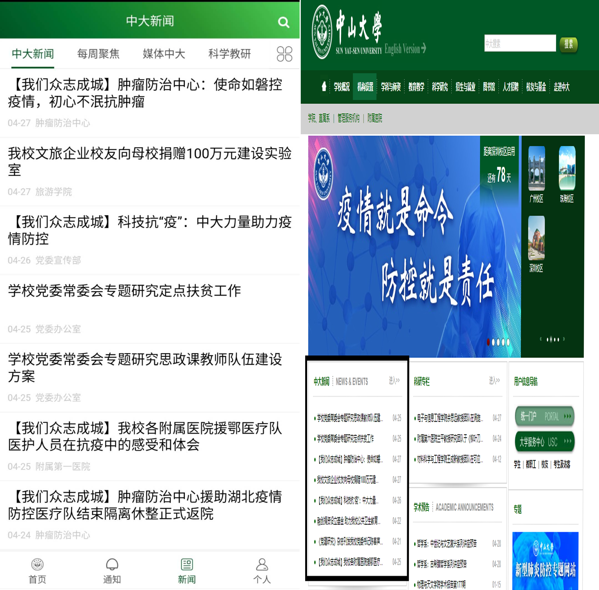
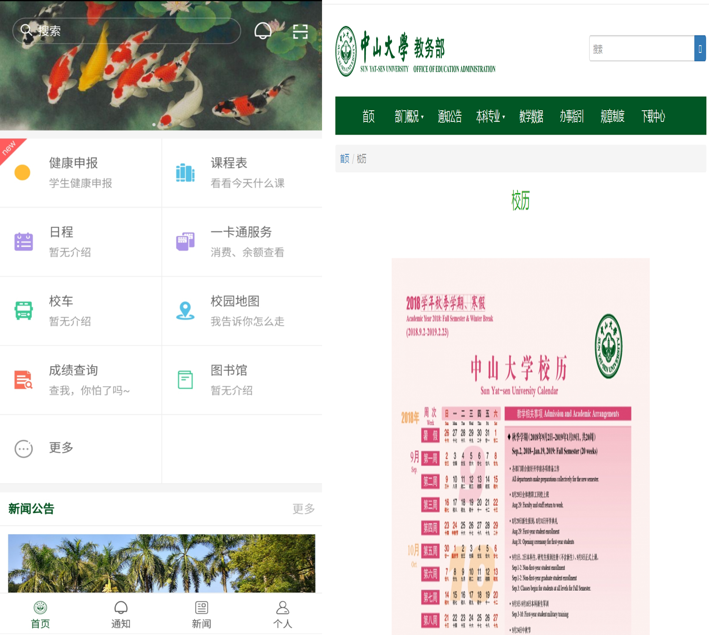
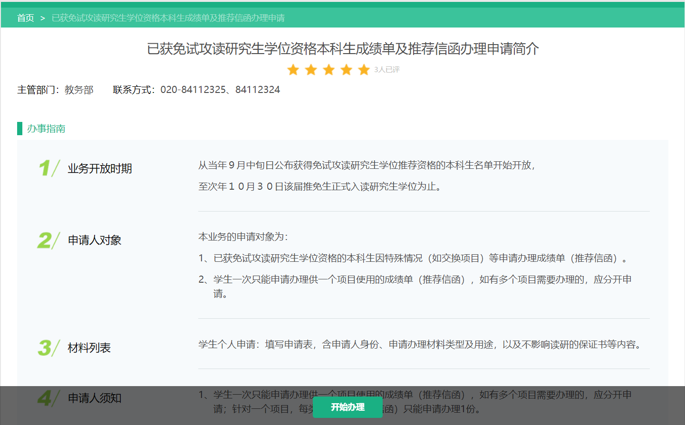
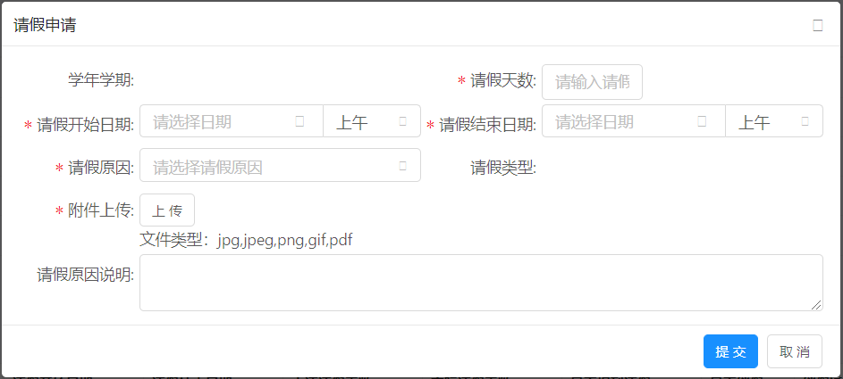
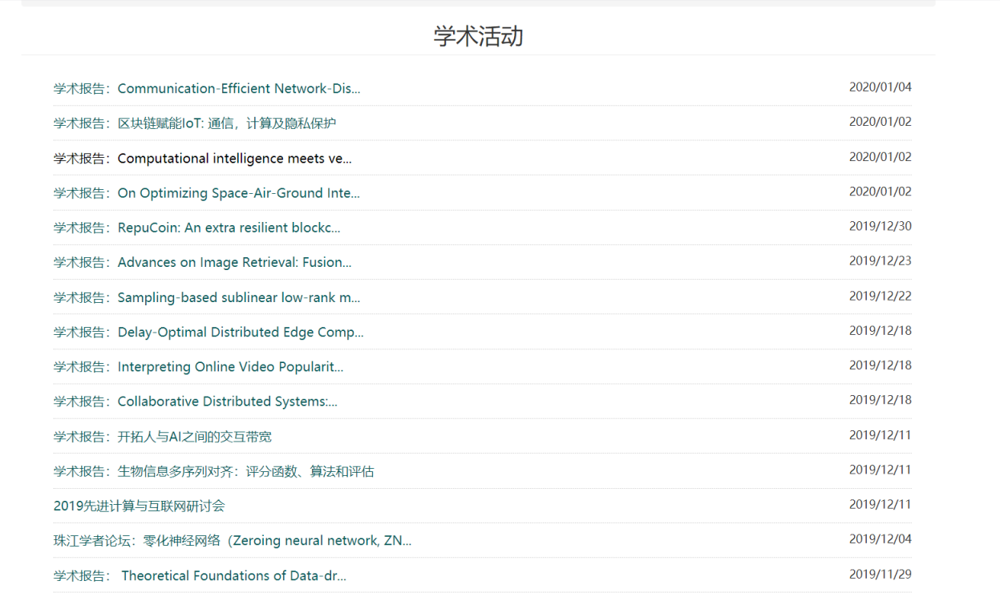
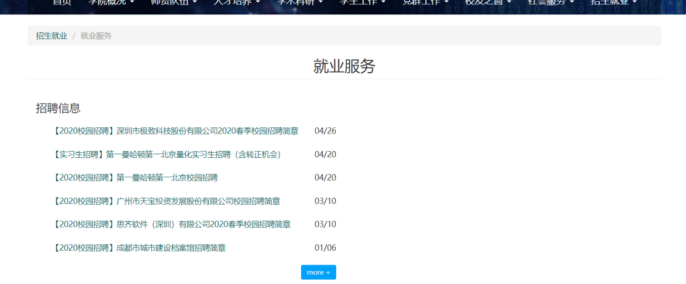
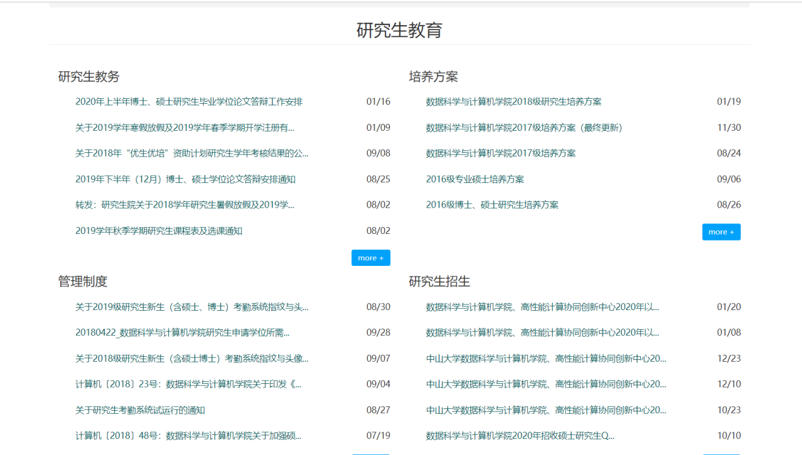

# 校园生活效率提升App: SYSU Campus Life - All in One 设计思路

> Proudly Presented by Invincible Inc.

- [校园生活效率提升App: SYSU Campus Life - All in One 设计思路](#%e6%a0%a1%e5%9b%ad%e7%94%9f%e6%b4%bb%e6%95%88%e7%8e%87%e6%8f%90%e5%8d%87app-sysu-campus-life---all-in-one-%e8%ae%be%e8%ae%a1%e6%80%9d%e8%b7%af)
  - [一、功能类别定义与App整体规划](#%e4%b8%80%e5%8a%9f%e8%83%bd%e7%b1%bb%e5%88%ab%e5%ae%9a%e4%b9%89%e4%b8%8eapp%e6%95%b4%e4%bd%93%e8%a7%84%e5%88%92)
  - [二、现有应用功能的总结与归类](#%e4%ba%8c%e7%8e%b0%e6%9c%89%e5%ba%94%e7%94%a8%e5%8a%9f%e8%83%bd%e7%9a%84%e6%80%bb%e7%bb%93%e4%b8%8e%e5%bd%92%e7%b1%bb)
  - [三、新功能的思考与归类](#%e4%b8%89%e6%96%b0%e5%8a%9f%e8%83%bd%e7%9a%84%e6%80%9d%e8%80%83%e4%b8%8e%e5%bd%92%e7%b1%bb)
  - [四、新App使用情况展望](#%e5%9b%9b%e6%96%b0app%e4%bd%bf%e7%94%a8%e6%83%85%e5%86%b5%e5%b1%95%e6%9c%9b)

截至今日，中山大学校内已有不少软件、服务上线，以提升中大师生和其他职务人员的校园生活效率。然而，分析当前已有的软件服务，很容易发现两大不足：
1. 功能分布零散。各项功能散布在不同的平台。
2. 功能不全。一些实用的功能目前还没有实现，亟需添加。

针对这两个问题，我们提出一个 __校园生活效率提升App: SYSU Campus Life - All in One__。 
对于该App的预期：集成现有功能，融合新功能，能高效地添加新功能，对各项功能进行明确分类。功能多样，模块清晰，简单易用。 

## 一、功能类别定义与App整体规划

根据使用场景的不同，可以将校园服务分为以下四类：

- 日常生活
- 行政办事
- 学习与科研
- 职业规划发展

自然，我们App（即题目要求中的“program”）的功能模块也能按这四类进行划分。

即App内四个功能模块：日常生活、行政办事、学习与科研 和 职业规划发展，每个模块下有若干相应功能（即题目要求中的“一组移动项目”）。

这个新App可以是一个独立的手机应用。每个独立的功能可以是应用里的小程序。

除了这些功能小程序外，该App还可以拥有一个主功能：直接寻人，即时交流。

即在App中可以直接用 姓名/学号/工号 搜索到对应人员，直接进行交流。大多数企业办公App有此功能。

在接下来的部分，我们将把现有应用的功能和可以添加的新功能按这四个类别进行归类。

## 二、现有应用功能的总结与归类

> 完成建议：可以在中大app、中大门户网站、学院网站以及微信公众号中查看现有功能，进行简要说明并截图在此展示。而后对功能进行归类，填入表中

- 校园资讯相关 --> 中大App(左)、新闻公告(右)

- 日常生活相关(部分图片，详见下方表格) --> 中大App中的部分功能(左)、校历(右)

  

- 行政办事相关(详见下方表格) --> 免试研究生资格本科生成绩单及推荐信办理(大学服务中心)

  

- 行政办事相关 --> 请假申请(教务系统)

- 学习与科研 --> 学术活动（学院官网）

- 职业规划发展 --> 就业服务、研究生教育

|类别|现有功能名称|
|-|-|
|校园资讯|新闻资讯（中大App）、新闻公告（门户网站）|
|日常生活|水电交费（中大App、中大总务后勤服务公众号）、学长帮忙（中大App）、同事吧（企业微信）、调查问卷（中大App）、校园活动（中大App）、校车（中大App）、校历（中大App、门户网站、教务系统、教务部）、校园地图（中大App）、一卡通查询（中大App）、失物招领（中大App）|
|心理辅导|`psycorner.sysu.edu.cn`。这个网站本应提供了一些功能，但现在上不去了。|
|行政办事|【教务】请假、退学、保留学籍等教务申请；【教务】补办学生证、学生卡；【教务】开具成绩单、办理推荐信、补办毕业证明；【保卫办】场地申请；其它各类教务行政办事。现有功能主要在大学服务中心。教务系统上也有部分教务办事功能，例如学籍表填报、异动信息申请、成绩转换申请、转专业申请、辅修双学位申请、缓考申请、重考报名、请假申请。教务系统和大学服务中心有部分功能重叠。同时，也有部分功能实际未投入使用，例如最近的重考报名，仍然使用邮件提交给教务员的方式。|
|学习与科研|学院官网通知|
|职业规划发展|学院官网通知、内部群聊|

## 三、新功能的思考与归类

> 完成建议：参考《第一次讨论总结》中的 “同学们想到的新功能”。以 “名称：功能描述” 的方式列举新功能，而后将 __新功能__ 填入表中

|类别|新增功能名称|
|-|-|
|日常生活|**跑腿接单**：需要帮忙的同学可以在APP中发布订单（如帮拿快递、帮买东西），其他同学在应用上看到合适的订单，可以接单帮拿，并获得相应报酬。想帮别人的同学也可以发布信息，说自己在快递点/喜茶/一点点/超市/便利店，可以帮拿帮买东西；**新生入学助手**：帮助新生进行入学流程，跟踪新生完成入学任务；**日程日历课程表**：在日历上显示课程表，教师、学校、学院部门还可以在日历上直接按日程布置任务。同学可以直接在日历中看到课程表、教学计划、作业DDL和学校事务安排等；**食堂窗口/菜品、校内店铺打分**：同学们可以给校内食堂的各个窗口/菜品 和 校内的一些店铺 打分并评论，以供他人参考；**垃圾分类**：提供广东省垃圾分类参考；|
|行政办事|**物业管理**：门禁卡补办、权限申请。宿舍电器家具报修；**应急求助**：联系保卫办、周边派出所、消防局；**公告发布**：集中发布学校社团活动、比赛等公众活动通知，按时间排序，可筛选；**医疗援助**：与学校直属医院对接，提供医院挂号、解答、健康管理等等功能；|
|学习与科研| __教师评分__ ：同学们可以浏览学院老师的信息，给老师评分，并留下评论，以供他人参考； __科研岗位发布__ ：集中发布校内科研岗位、实验室招聘信息，按时间排序，可筛选；|
|职业规划发展| __企业职位发布__ ：集中发布校招、实习信息，按时间排序，可筛选； __企业评价__ ：同学们可以给每位企业打分并评论，以供他人参考；|

## 四、新App使用情况展望

> 完成建议：考虑：基于生活场景，描述我们的新功能会给校园生活带来怎样的方便。对比现有的应用，描述我们的新App会带来怎样的用户体验变化。

|场景类别|该场景下用户体验变化|
|-|-|
|日常生活|（展望）|
|行政办事|（展望）|
|学习与科研|（展望）|
|职业规划发展| （展望）|

